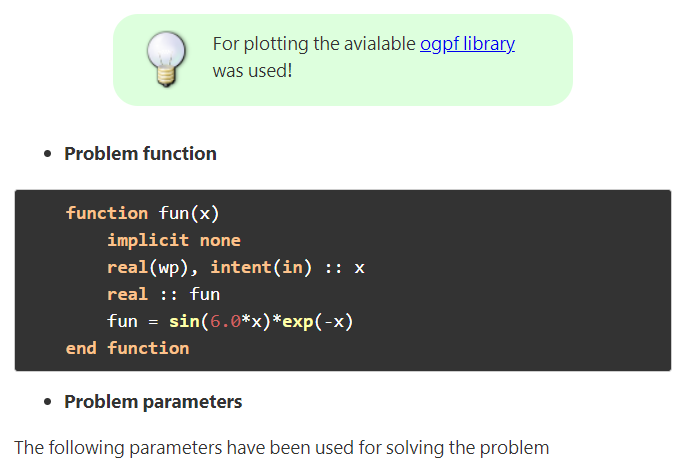

# TiddlyFor

TiddlyFor is a flavor of [TiddlyWiki](http://tiddlywiki.com). It is actually a new [edition](https://tiddlywiki.com/#Editions)

TiddlyFor is a single file, self-content wiki for fortran programmer but can be used for any other purposes. Its main feature is:

### Features

* Syntax highlighting for modern Fortran
* Support math formula through katex
* Colorful notebox (Classic Note, Notebox, Framedbox)
* Customized stylesheets (Custom Styles, Native TW box)
* Table of contents
* Tags
* Powerful search box
* Tiddler manager
* Refined to be suitable for research and education

### How to use
No installation is requird. Simply download the html file (TiddlyFor.html) open it in your favorite browser!

* For more help see [TiddlyWiki](http://tiddlywiki.com)
* For editing it is recommneded to use TiddlyDesktop or similar. See [TiddlyWiki](http://tiddlywiki.com)

## Sample Contents

* Sample Tiddler

* Sample Fortran syntax highlight

### Note
* TiddlyFor can be customized through plugins
* Different themes (styles) for syntax highlighting can be used see highligh.js plugin
* Syntax highlighting for several scientific languages and some common language is available in TiddlyFor. 
* Other language can be simply added! See the highlight plugin.