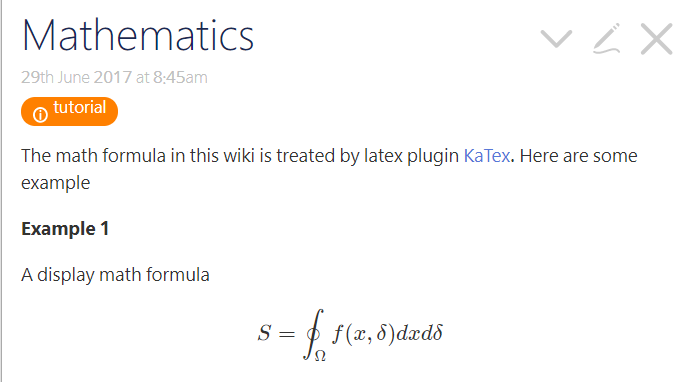

# TiddlyFor

TiddlyFor is a flavor of [TiddlyWiki](http://tiddlywiki.com). It is actually a new [edition](https://tiddlywiki.com/#Editions)

TiddlyFor is a single file, self-content wiki for fortran programmer but can be used for any other purposes. It can be put on the web, sent as an email attachment, or put on a thumb drive. Its main feature is:

### Features

* Syntax highlighting for modern Fortran
* Support math formula through katex
* Colorful notebox (Classic Note, Notebox, Framedbox)
* Customized stylesheets (Custom Styles, Native TW box)
* Export a tiddler as a JSON or static html file
* Table of contents
* Tags
* Powerful search box
* Tiddler manager
* List, filters and advanced search
* Can be used for Github project documentation [Github projecy](https://tiddlywiki.com/#Using%20TiddlyWiki%20for%20GitHub%20project%20documentation)
* Refined to be suitable for research and education

### How to use
No installation is requird. Simply download the html file (TiddlyFor.html) open it in your favorite browser!

* For more help see [TiddlyWiki](http://tiddlywiki.com)
* For editing it is recommneded to use TiddlyDesktop or similar. See [TiddlyWiki](http://tiddlywiki.com)

## Exporting tiddlers
For documentation purpose, note taking and sharing any chunk of rich data, you can export a tidller as a single static html file, attach it to an email, put on the web, or distribute with your software, code, etc. See this wonderful capability on: [How to export tiddlers](https://tiddlywiki.com/#Using%20TiddlyWiki%20for%20GitHub%20project%20documentation)

## Documentation

* Wiki syntax can be learned in a fraction of hour through this page: [WikiText - TiddlyWiki](https://tiddlywiki.com/static/WikiText.html)
* Also see tiddlers with **tutorial** tag for customized syntax can be read
* For math formula typing see [katex wiki](https://github.com/khan/katex/wiki)

* More learning resources on [TiddlyWiki Learning](https://tiddlywiki.com/)

## Sample Contents

* Sample Tiddler

* Sample Fortran syntax highlight

### Note
* TiddlyFor can be customized through plugins
* Different themes (styles) for syntax highlighting can be used see highligh.js plugin
* Syntax highlighting for several scientific languages and some common language is available in TiddlyFor. 
* Other language can be simply added! See the highlight plugin.

### More on using TiddlyWiki on the web
* TiddlyFor can be stored on Google Drive and used directly. See [TiddlyDrive](https://tiddlywiki.com/#TiddlyDrive%20Add-on%20for%20Google%20Drive%20by%20Joshua%20Stubbs)
